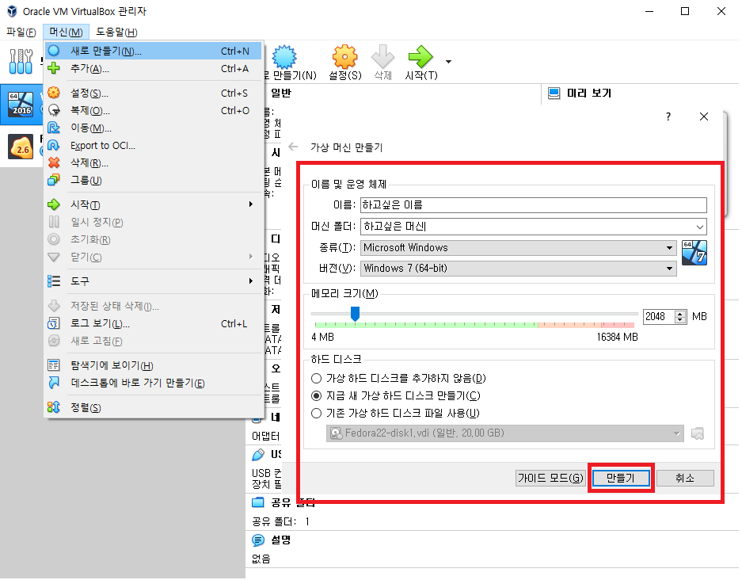
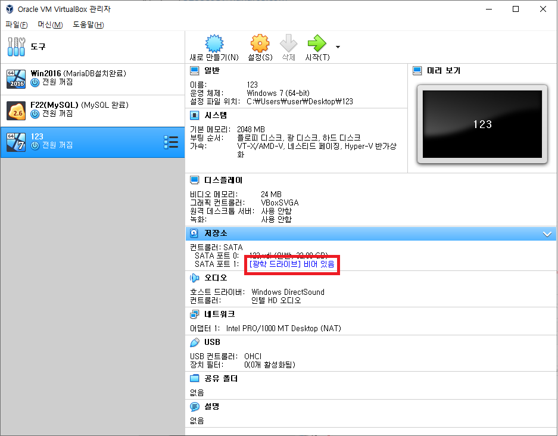
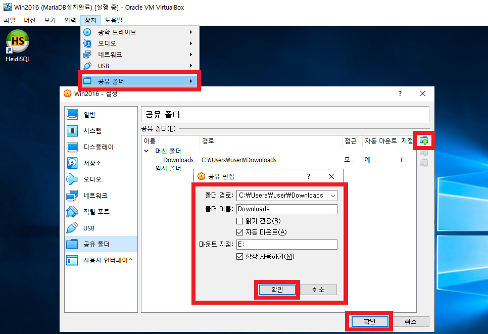
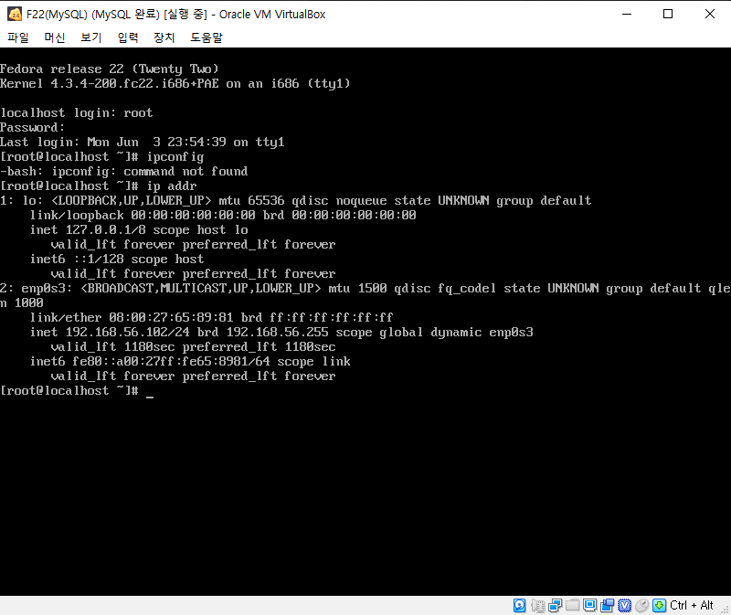

# 01일차 Orientation 190603

## 선생님 소개

**우재남** 선생님

**메일주소** : 5288893@hanafos.com

책은 **파이썬 for Beginner** (한빛아카데미)로 진행

## DB를 위한 다운로드 목록

다운로드 목록은 선생님께서 수업시간에 원활한 진행을 위해서 추천해 주신 것들 입니다.

### 1. Virtual Box [Virtual Box 링크](https://www.virtualbox.org/)

Virtual Box란 가상머신을 돌리기 위한 하나의 툴 입니다. Vmware, Virtual Box, Hyper-V 등이 있습니다.

#### Windows Server 2016 [Windows Server 2016 링크](<https://www.microsoft.com/en-us/evalcenter/evaluate-windows-server-2016?filetype=ISO>)

* 머신을 링크를 받아 파일 저장

* 아래 이미지를 따라서 가상 머신 만들기

  

* 광학 드라이브를 클릭하여 이전에 저장한 파일(Windows Server 2016) 불러오기

  

* 불러와서 Windows Server 2016 설치 후 종료

* 공유 폴더 설정

  

#### Linux(Fedora 22)

- Virtual Box 에서 Fedora에 MySQL설치 연결 후 로그인 후 네트워크 확인해보기

- Virtual Box 에서 Fedora에 MySQL설치 연결 후 로그인 후 네트워크 확인해보기

  - local host login : **`root`**
  - password : **`password`**
  - **`ip addr`** 네트워크 상태 확인

  

### 2. MySQL [MySQL 링크](<https://dev.mysql.com/downloads/mysql/>)

Oracle은 Database(이하 DB)를 관리해주는 소프트웨어를 개발하여 독자적으로 운영하다가 Free Software Foundation(FSF)에서 Gnu’s Not Unix(GNU) 프로젝트로 만들어진 open-sourse Relational DataBase Management System(RDBMS) 입니다.

### 3. MariaDB [MariaDB 링크](<https://downloads.mariadb.org/>)

MariaDB 는 MySQL이 Oracle로 인수되면서 MySQL에 몇몇 개발자들이 나와서 무료로 제공하려고 만든 DB 입니다.

### 4. HeidiSQL [HeidiSQL 링크](<https://www.heidisql.com/download.php>)

실무에서는 SQL Server Management Studio(SSMS)를 사용하지만 우리는 가벼운 프로그램을 받기위해서 

Quary Language만 보내기 위해  가벼운 프로그램인 HeidiSQL을 받아서 사용합니다.

### 5. SQL Server 2019 [SQL Server 2019 링크](<https://www.microsoft.com/en-us/evalcenter/evaluate-sql-server-2019-ctp>)

SQL Server 는 Windows에서 만든 DB Server 입니다.

### 6. SQL Server Management Studio [SSMS 링크](<https://docs.microsoft.com/en-us/sql/ssms/download-sql-server-management-studio-ssms?view=sql-server-2017>)

SSMS는 SQL Server를 관리하기 위한 에디터 입니다.

## 컴퓨터 역사

IBM에서 Apple 컴퓨터가 대박을 치자 오픈형 PC공개, 요즘 PC들은 IBM의 PC 호환기구 라고 생각하면 됩니다.

IBM컴퓨터의 운영체제를 Microsoft를 사용, Microsoft가 성장 후 운영체제를 따로 팔기 시작했다.

### MS 운영체제

16bit는 가정용 32bit는 기업용으로 초기에 제작하였다. 컴퓨터가 발전하면서 XP 이후로는 통일하였다. 기술이 더 발전하며 현재는 32bit와 64bit 체제를 같이 이용한다.

* **16bit** : DOS(Disk Operating System) -> W3.1 -> W95 -> W98 -> ME -> XP(Home)
* **32bit** : NT(New Technology) 프로잭트(Unix 표준으로 windows 시스템으로 만듬) -> NT3.51 -> NT4.0 -> W2000 -> XP
* **64bit** : Vista -> W7 -> W8 ->W8.1 ->W10

| 32bit       | 64bit  |
| ----------- | ------ |
| x86( 80-86) | x64    |
| x32         | x86_64 |
| i386        | AMD64  |
| i586        |        |

Vista부터는 32bit 와 64bit를 같이 출시였는데 호환성 때문에 32bit를 지원하였다.

<u>햇갈리게 32bit는 왜 x86을 쓸까요?</u>: 초기에 intel 32bit 이하계열 칩셋 제품명이 80-86 숫자를 붙였기 때문에 

<u>32bit CPU 를 쓰면 안되는 이유</u>:  RAM을 기본 3GB 밖에 사용하지 못함 예전에는 RAM의 용량이 커질지 몰랐음

### 오픈소스 버전 종류

[Software release life cycle Wikipedia](https://en.wikipedia.org/wiki/Software_release_life_cycle)

보통 버전의 이름을 지을 때는 Alpha -> Beta -> RC(Release Candidate) -> RTM(Release To Maunfacturing) 이렇게 많이합니다.

오픈소스 버전은 잘 안올립니다. 이유는? 버전 업데이트란 기대감도 커지기 때문에 그래서 소수자리를 올립니다.

오픈소스는 0으로 시작해서 0.01, 0.02 등으로 업데이트 하고 크게 바뀌면 1.0으로 올릴 수 있습니다. 개발자의 마음입니다.

