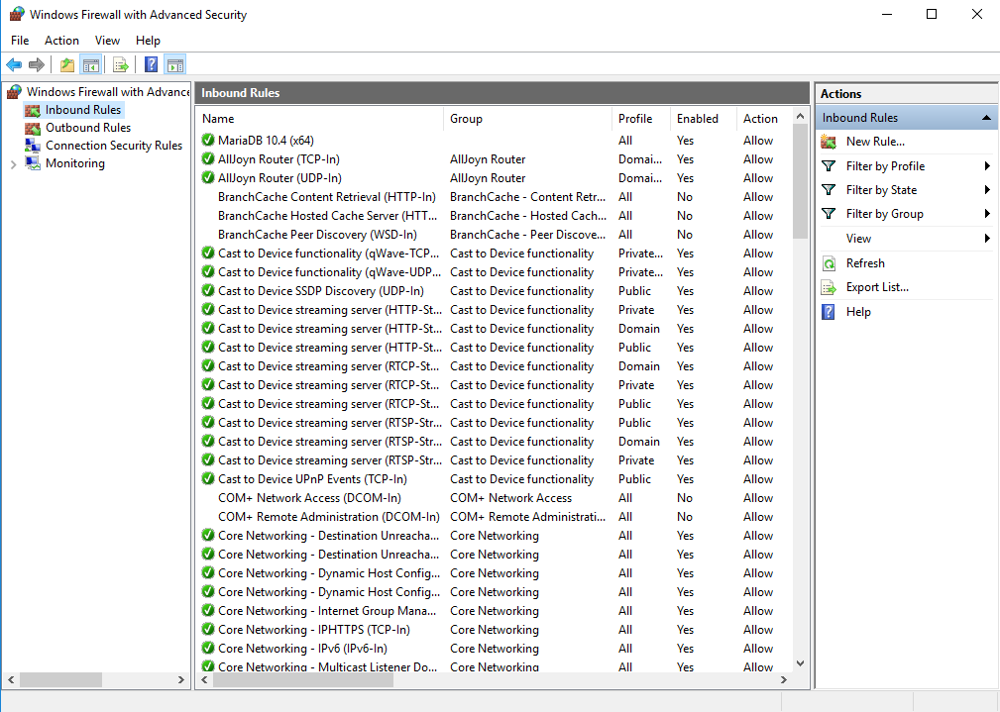
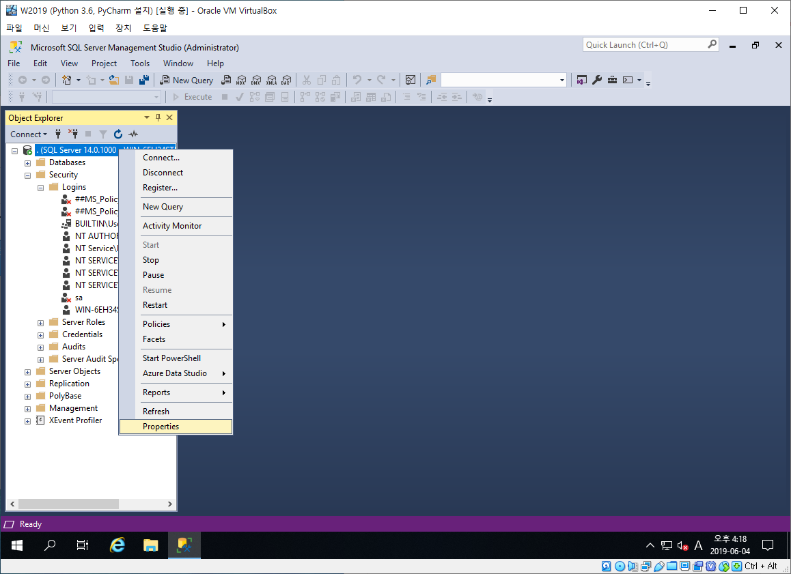
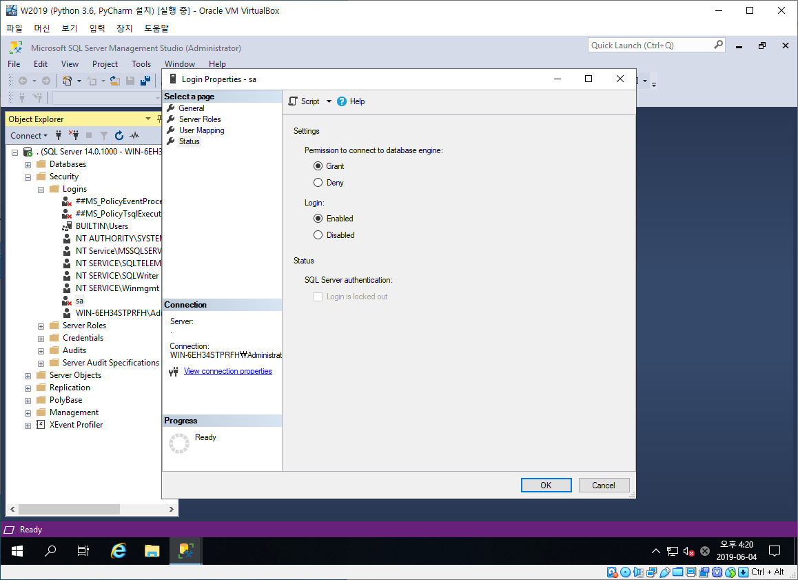
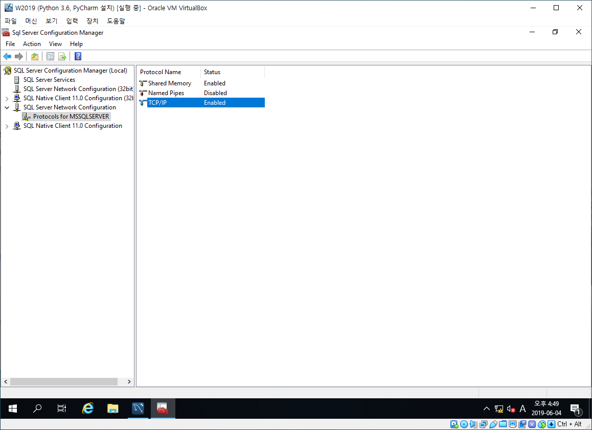
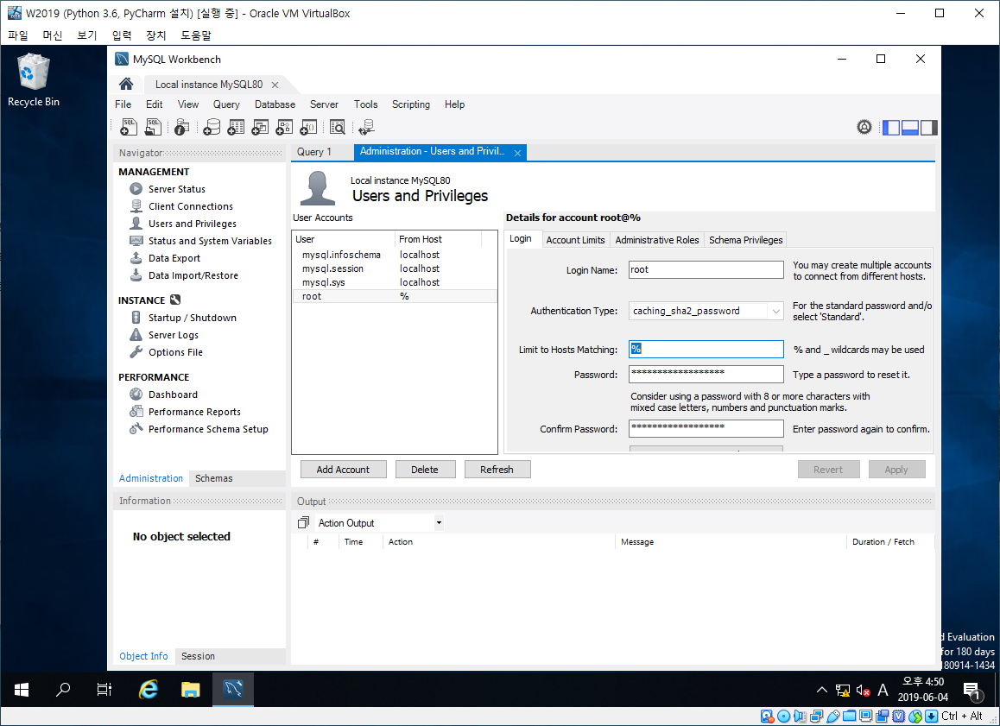

# 02일차 서버 운영해보기 190604

## 복습

1. Computer = Hardware(H/W) + Software(S/W)
   - H/W = CPU, RAM, Disk(HDD, SSD)
     - HDD : 속도 RPM (10000, 7200, 4xxx)
     - SSD : M.2, 256GB
   - S/W = OS(Unix, Linux, Windows)
     - 32bit : x86, i386, i586, x32
     - 64bit : x64, x86_64, AMD64
2. 가상머신 : Virtual Box
   - Fedora 22 (MySQL 5.7) 다운로드
   - Window Server 2016 다운로드
     - MariaDB 10.4 RC 다운로드
     - SQL Server 2019 CTP 다운로드

서버 컴퓨터는 보통 제공자, 클라이언트 컴퓨터는 요청자를 의미한다.

## 외부에서 DB서버 접속하기

가상머신을 설치한 곳에 Windowers Server 2016 운영체제를 설치한다. 그 안에 SQL Server Management Studio와 MariaDB를 설치한다.

### 1. SQL-Server 네트워크 설정

아래 2, 3, 4는 SQL Server Management Studio를 설치하여 설정해 준다. 사진위에 순서대로 하면 된다.

1. Setting Port
   - Public IP가 빌딩라면 Private IP는 몇호이고 Port는 들어가는 문이다.  컴퓨터 기본설정은 자주 사용하는 포트를 제외하고 모든 포트를 닫아 놓는다. Port 번호는 TCP/UDP 0~64533개로 구성되어있다.
   - port를 열어놔야 Clinet가 서비스를 이용할 수 있고, 이를 설정하는게 기본적으로 Windows 방화벽어다.
   - DB 포트번호 : MS-SQL(1433), Oracle(1521, 1522), MySQL(3306)
2. Setting Authentication mode
3. Allow access to accounts
4. TCP/UDP Enabled

#### Setting Port(Windows Firewall with Advanced Secunity)

cmd 창 -> wf.msc 입력 -> Inbound Rules에서 마우스 오른쪽 클릭 -> New Rule -> Rule Type 에서 Port 선택 후 Next -> MS-SQL(1433), Oracle(1521, 1522), MySQL(3306)을 열고 -> 각종 설정 후 -> 이름에 맞게 저장

> 실무에서 재시작할 때 컴퓨터를 재부팅하는 것은 안 좋다. 껐다가 킨 효과를 사용하는 것이 Restart이다. 또 새벽에 Restart하는 방법을 사용한다.

#### Setting Authentication mode

Select DB -> Propeties -> Security -> Windows Authentication mode -> SQL Server and Windows Authentication mode

#### Allow access to accounts

Security -> Login -> Select Account -> Properties -> Setting Passward -> Status -> Login Enabled -> Refresh

#### TCP/UDP Enabled

Sql Server Configuration Manager -> Select DB -> TCP/IP Enabled -> Check IP Address -> Restart

### 2. MySQL(MariaDB) 설정

포트번호는 위에 MS-SQL과 같이 열어주고 계정 설정을 해준다.

#### Allow access to accounts2

계정을 생성하고 Limit to Hosts Matching을 %로 설정해준다. %는 모든 IP를 의미한다.

---

## 파이썬

### 책 : 파이썬 for Beginner

#### 1장 - 파이썬 들여야보기 [Python 설치 링크](https://www.python.org/downloads/)

- 파이썬(Python)은 ``Guido van Rossum``이라는 프로그래머가 C언어로 제작해 1991년 공식 발표했다. 우리가 흔히 말하는 파이썬은 CPython을 의미하며 다양한 개발자들이 파이썬의 분기된 언어를 개발했다.
- 제작자는 어릴 적 좋아했던 TV 프로그램인 <몬티 파이썬의 날아다니는 서커스> 에서 따왔다고 한다. 파이썬의 사전적 의미는 비단뱀이다.
- 파이썬의 장점은 강력한 기능을 무료로 제공, 읽기 쉽고 사용이 쉽다. 사물인터넷과 잘 연동되고 강력한 외부 라이브러리들이 있고 웹 프레임워크를 사용할 수 있다.
- 파이썬은 인터프리트(스크립트) 언어로써 소스 코드를 한 줄씩 읽어 실행되어 별도의 실행파일이 생성되지 않는다. 컴파일러 언어로는 C, C++, JAVA 등이 있다.

#### Appendix - PyCharm 설치 [Pycharm 링크](https://www.jetbrains.com/pycharm/)

1. 선생님이 쓰시는 Python IDE(Intergrated Development Environment)는 PyCharm이다.
2. 디버그
   1. 중단점 지정(Toggle Line Breakpoint) **`ctrl+F8`**
   2. 현재창 디버그 실행(Debug) **`shift+F9`**
      - 해당 행을 실행 후 넘어가는 것(Step Over) **`F8`**
      - 해당 함수로 들어가기(Step Into)**`F7`**

## 과제

- Windows Server 2019 ISO 파일 다운로드
- SQL Server 2017 Express 다운로드
- MySQL 8.0.x 다운로드
- 자신이 정리한 내용을 확인하면서 진행
  - Virtual Box에 Win2019 설치하고 설정 -> 스냅샷
  - Win2019에 SQL 2017, MySQL 8.0을 설치하고 설정 -> 스냅샷
  - Win2019에 Python 3.6과 PyCharm 설치후 Hello World 작성 -> 스냅샷
  - PC의 HeidiSQL에서 SQL 2017, MySQL 8.0에 접속
- 캡처 : Pycharm 에서 Hello Wolrd 출력, HediSQL에서 접속된 화면
- 강사PC : \70.12.113.130
- 제출 : 카페 [미션/과제 제출방]에 다음 제목으로 제출
  - [미션 6/4] 빅데이터, 김-상
