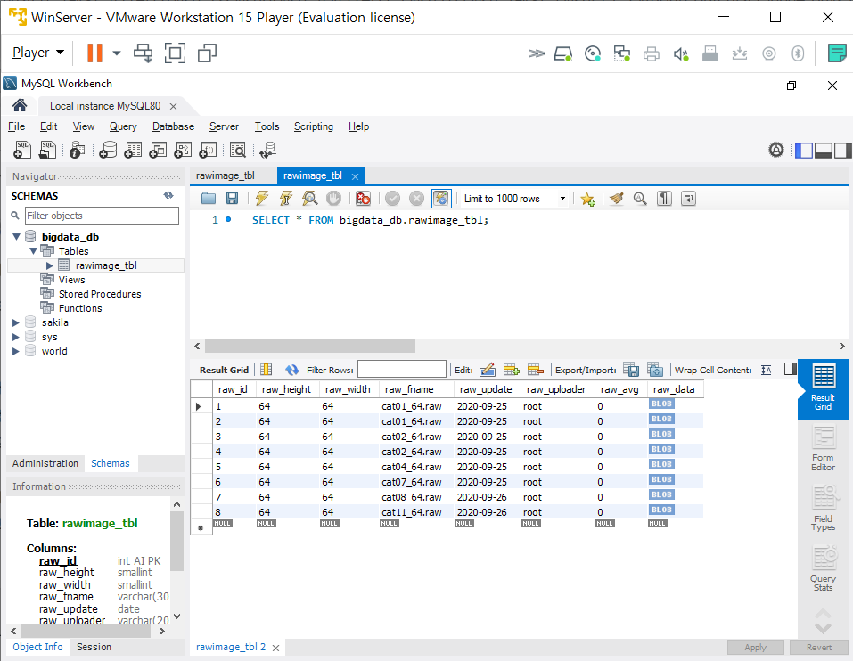

# 08일차 파이썬 데이터 시각화 190614

## DB

DB를 쓰는 이유는 공유하기 위해서, 관리하기 편해서 쓴다. 우리가 만든 RAW 파일을 DB로 보내는 연습을 하자.

``` sql
CREATE DATABASE studentDB;
SHOW DATABASE;
USE studentDB;
CREATE TABLE studentTBL (std_id INT, std_name CHAR(8), 
std_age SMALLINT);
INSERT INTO studentTBL (std_id, std_name, std_age)
VALUES(1, '홍길동', 21);
SELECT * FROM studentTBL;

-- 컴퓨터 비전용 데이터 통합 관리 시스템
-- DataBase 설계
-- DB : BigDataDB
-- Table : rawImageTBL
CREATE DATABASE bigdata_db;
USE bigdata_db;
CREATE TABLE rawimage_tbl
(raw_id INT AUTO_INCREMENT PRIMARY KEY, raw_height smallint, raw_width smallint, raw_fname VARCHAR(30), raw_update DATE, raw_uploader VARCHAR(20), raw_avg SMALLINT, raw_data LONGBLOB);
```

>논리적 설계 : 아이디, 가로크기, 세로크기, 파일명, 평균값, 업로드 일자, 업로더, 이미지 파일
>
>물리적 설계 : raw_id int, raw_height smallint, raw-width smallint, raw_fname VARCHAR(30), raw_update DATE, raw_uploader VRCHAR(20), raw_data LONGBLOB)

### LOB

LOB(Large Object) 란 큰 객체이다.

크기가 큰 데이터는 DB에 저장하기 힘들기 때문에 OS상 존재하는 파일을 데이터베이스가 직접 접근하게 된다.

종류

- CLOB(Character Large Object): 문자 대형 객체 ex) text, ...
- BOLB(Binary Large Object): 이진 대형 객체, ex) images, videos, mp3, ...

## 과제풀이 및 코드

### 컴퓨터 비전 흑백 이미지(.raw) 시각화 Version 0.04

- 08-01 모핑 추가

  ``` python
  # ========== Vision Algorithm(0.04) ==========
  def morph_image():
      global window, canvas, paper, filename, inH, inW, outH, outW, inImage, outImage
      outH = inH
      outW = inW
      outImage = []
      outImage = malloc(outH, outW)
      # 추가 영상 선택
      filename2 = tk.filedialog.askopenfilename(parent=window,
          filetypes=(("RAW file", "*.raw"), ("All file", "*.*")))
      if filename2 == '' or filename2 is None:
          return
  
      fsize = os.path.getsize(filename2)  # 파일의 크기(바이트)
      inH2 = inW2 = int(math.sqrt(fsize))  # 핵심 코드
  
      # 입력영상 메모리 확보
      inImage2 = []
      inImage2 = malloc(inH2, inW2)
  
      # 파일 --> 메모리
      with open(filename2, 'rb') as rFp:
          for i in range(inH2):
              for k in range(inW2):
                  inImage2[i][k] = int(ord(rFp.read(1)))
  
      import threading
      import time
  
      def morp_func():
          w1 = 1
          w2 = 0
          for _ in range(20):
              for i in range(inH):
                  for k in range(inW):
                      new_value = int(inImage[i][k]*w1 + inImage2[i][k]*w2)
                      if new_value > 255:
                          new_value = 255
                      elif new_value < 0:
                          new_value = 0
                      outImage[i][k] = new_value
              display_image()
              w1 -= 0.05
              w2 += 0.05
              time.sleep(0.5)
  
      threading.Thread(target=morp_func).start()
  # ========== Vision Algorithm(0.04) Endline ==========
  ```

  ``` python
  # ==================== Main code ====================  
      comVisionMenu1.add_separator()
      comVisionMenu1.add_command(label="morphing_image", command=morph_image)
  ```

- 08-02 파이썬에서 MySQL에 접속하여 RAW파일을 쓴다.

  ``` python
  # MySQL 에 RAW 파일 쓰기

    # Import
    import tkinter as tk
    from tkinter import simpledialog
    from tkinter import filedialog
    import pymysql
    import os
    import math
    import datetime
    import tempfile

    # Global Variable
    IP_ADDR = '192.168.111.10'
    USER_NAME = 'root'
    USER_PW = '1234'
    DB_NAME = 'bigdata_db'
    CHAR_SET = 'utf8'


    # Function
    def select_file():
    file_name = tk.filedialog.askopenfilename(
    parent=window, filetype=(('RAW file', '*.raw'), ('All file', '*.*')))
    if file_name == '' or filedialog == None:
    return
    edt1.insert(0, str(file_name))


    def upload_file():
    con = pymysql.connect(host=IP_ADDR, user=USER_NAME,
    password=USER_PW, db=DB_NAME, charset=CHAR_SET)
    cur =con.cursor()

    full_name=edt1.get()
    with open(full_name, 'rb') as rfp:
    bin_data = rfp.read()

    fname = os.path.basename(full_name)
    fsize = os.path.getsize(full_name)
    height = width = int(math.sqrt(fsize))
    now = datetime.datetime.now()
    up_date = now.strftime('%Y-%m-%d')
    up_user = USER_NAME

    sql = (f'INSERT INTO rawImage_TBL(raw_id, raw_height, raw_width, '
        'raw_fname, raw_update, raw_uploader, raw_avg, raw_data) '
        'VALUES(NULL, {}, {}, "{}", "{}", "{}", 0, %s);'
        .format(str(height), str(width), fname, up_date, up_user))

    print(sql)
    tuple_data = (bin_data,)
    cur.execute(sql, tuple_data)
    con.commit()
    cur.close()
    con.close()


    def download_file():
    con = pymysql.connect(host=IP_ADDR, user=USER_NAME,
    password=USER_PW, db=DB_NAME, charset=CHAR_SET)

    cur = con.cursor()
    sql = "SELECT raw_fname, raw_data FROM rawImage_TBL WHERE raw_id = 1"
    cur.execute(sql)

    fname, bin_data = cur.fetchone()
    full_path = tempfile.gettempdir() + '/' + fname
    with open(full_path, 'wb') as wfp:
    wfp.write(bin_data)

    print(full_path)
    cur.close()
    con.close()
    print(sql)


    # Main
    if __name__ == "__main__":
    window = tk.Tk()
    window.geometry('500x200')
    window.title('Raw -> DB Ver0.01')

    edt1 = tk.Entry(window, width=50)
    edt1.pack()

    btn_file = tk.Button(window, text='Select File', command=select_file)
    btn_up_file = tk.Button(window, text='Upload', command=upload_file)
    btn_down_file = tk.Button(window, text='Download', command=download_file)

    btn_file.pack()
    btn_up_file.pack()
    btn_down_file.pack()

    window.mainloop()
  ```

### MySQL DB 업로드 Version 0.01

- 08-02 MySQL DB 01

    ``` python
    # Import
    import tkinter as tk
    from tkinter import simpledialog
    from tkinter import filedialog
    import pymysql
    import os
    import math
    import datetime
    import tempfile

    # Global Variable
    IP_ADDR = '192.168.111.10'
    USER_NAME = 'root'
    USER_PW = '1234'
    DB_NAME = 'bigdata_db'
    CHAR_SET = 'utf8'


    # Function
    def select_file():
        file_name = tk.filedialog.askopenfilename(
            parent=window, filetype=(('RAW file', '*.raw'), ('All file', '*.*')))
        if file_name == '' or filedialog == None:
            return
        edt1.insert(0, str(file_name))


    def upload_file():
        con = pymysql.connect(host=IP_ADDR, user=USER_NAME,
            password=USER_PW, db=DB_NAME, charset=CHAR_SET)
        cur =con.cursor()

        full_name=edt1.get()
        with open(full_name, 'rb') as rfp:
            bin_data = rfp.read()

        fname = os.path.basename(full_name)
        fsize = os.path.getsize(full_name)
        height = width = int(math.sqrt(fsize))
        now = datetime.datetime.now()
        up_date = now.strftime('%Y-%m-%d')
        up_user = USER_NAME

        sql = ('INSERT INTO rawImage_TBL(raw_id, raw_height, raw_width, '
            'raw_fname, raw_update, raw_uploader, raw_avg, raw_data) '
            'VALUES(NULL, {}, {}, "{}", "{}", "{}", 0, %s);'
            .format(str(height), str(width), fname, up_date, up_user))

        print(sql)
        tuple_data = (bin_data,)
        cur.execute(sql, tuple_data)
        con.commit()
        cur.close()
        con.close()


    def download_file():
        con = pymysql.connect(host=IP_ADDR, user=USER_NAME,
            password=USER_PW, db=DB_NAME, charset=CHAR_SET)
        
        cur = con.cursor()
        sql = "SELECT raw_fname, raw_data FROM rawImage_TBL WHERE raw_id = 1"
        cur.execute(sql)

        fname, bin_data = cur.fetchone()
        full_path = tempfile.gettempdir() + '/' + fname
        with open(full_path, 'wb') as wfp:
            wfp.write(bin_data)

        print(full_path)  # C:\Users\wansang\AppData\Local\Temp\
        cur.close()
        con.close()
        print(sql)


    # Main
    if __name__ == "__main__":
        window = tk.Tk()
        window.geometry('500x200')
        window.title('Raw -> DB Ver0.01')
        
        edt1 = tk.Entry(window, width=50)
        edt1.pack()

        btn_file = tk.Button(window, text='Select File', command=select_file)
        btn_up_file = tk.Button(window, text='Upload', command=upload_file)
        btn_down_file = tk.Button(window, text='Download', command=download_file)

        btn_file.pack()
        btn_up_file.pack()
        btn_down_file.pack()

        window.mainloop()
    ```

    결과

    

## 과제

- [컴퓨터 비전] 툴 기능 완성하기
  - 디스플레이 이미지에서 대용량 파일의 경우, 일정 크기로 보이게 하기
  - 히스토그램 데이터 시각화 기능을 matplotlib 없이 직접 구현하기
- MySQL에 RAW파일 업로드 하기
  - 선택 기능 1: 특정 폴더를 선택하면 해당 폴더의 RAW 파일이 모두 업로드 되기
  - 선택 기능 2: RAW 파일의 평균, 최대값, 최소값도 계산되어 업로드
- [컴퓨터 비전] 툴이 데이터베이스에서 처리되도록 하기
  - 기능 1: 수정된 out_image 저장하기
  - 기능 2: 불러오기
